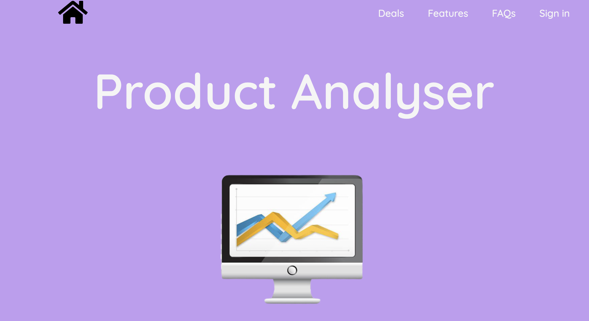
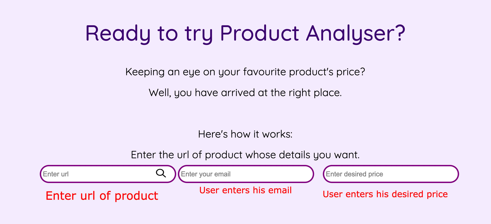
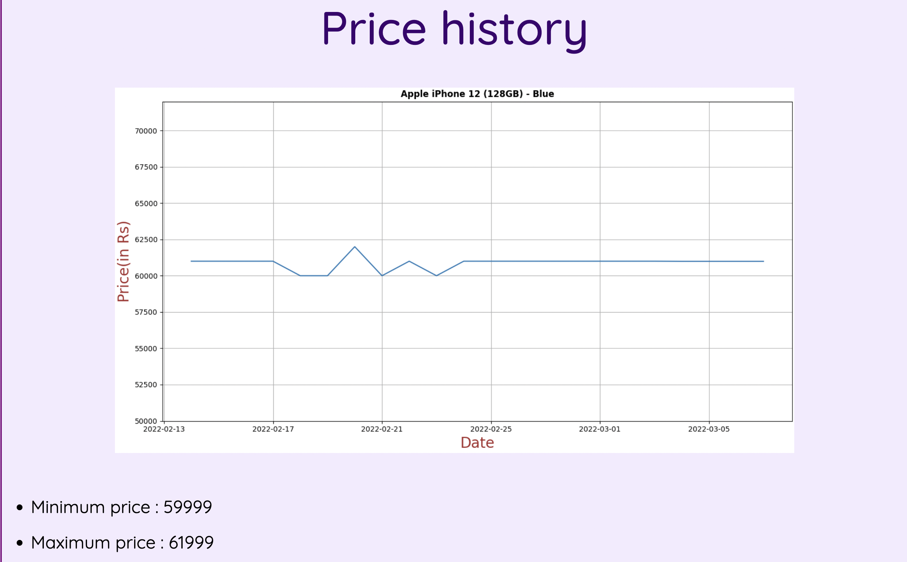
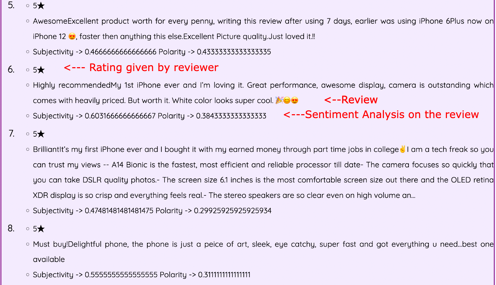
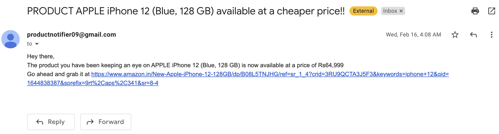

# Product Analyser
Product Analyser is a simple tool, which fetches data from the url, analyze it, and then shows the user the data and analysis it performed on it.

## Requirements
The requirements for this project are in the file `pyproject.toml`. One has to run the command `poetry install` to get these dependencies on their virtual enviroment.
Namely the project uses:

1. [Requests](https://docs.python-requests.org/en/latest/),for getting the data.
2. [Beautiful Soup](https://pypi.org/project/beautifulsoup4/),for parsing the HTML data.
3. [Flask](https://flask.palletsprojects.com/en/2.0.x/),for creating a Python server.
4. [Matplotlib](https://matplotlib.org/),for plotting the graph.
5. [lxml](https://lxml.de/parsing.html),a HTML parser.
6. [SMTPLib](https://docs.python.org/3/library/smtplib.html),for sending emails to users.
7. [TextBlob](https://textblob.readthedocs.io/en/dev/),for perfoming Sentimental Analysis on reviews of product.

## Setup and Installation
Currently its not hosted, so one has to run it locally, and use their own development server. Get the dependencies, and run the code `python main.py`. 
You may also have to create a `.env` file. 

## Overview
The code fetches data from the url entered, and then display the details on a web-page. Currently it shows:

1. Product details
2. Detailed graph of price vs date, showing its price history over the dates
3. Maximum and Minimum price reached by the product
4. Reviews and its sentiment score
5. Sends email to the user, when the current price of the product is less than or equal to the desired price, given by the user.

It fetches the data from the `requests` module, parse it using `bs4` (beautiful soup), plots the graph using `matplotlib`, sends email via `smtplib`, stores the user details on a database via `sqlite` module, and creates a server via `flask` framework of Python, displaying the web-pages accordingly. 

## How it looks

The front page of the website

Gets data from the user

Displays the product's information

Shows the price history of the product

Performs Sentiment Analysis on the reviews given to the product

Notifies the user, when the price drops

## Future
There are many things which can be implemented to make this tool better

1. Future Price prediction of the product, based on the data.
2. Login/Register, feature.
3. Fetch data from any site(currently it fetches from two websites).
